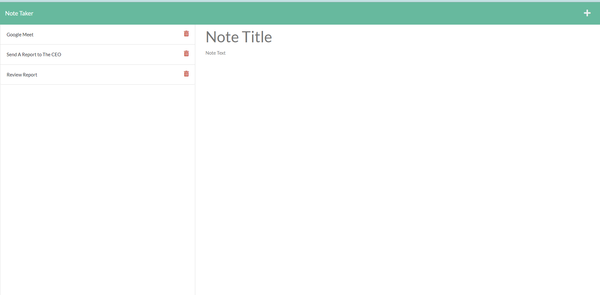

# Note Ttaker application

## Description

    This is a simple Node.js Note Taker application that lets users add, view, and delete notes as needed. It is built on an express backend and stores and retrieves note data from a JSON file.

## Table of Content

- [Installation](#installation)
- [Usage](#usage)
- [License](#license)
- [Visual](#visual)
- [Contributing](#contributing)
- [Questions](#questions)

## Installation

    In order to use this application, simply git clone the repo to your local so that you have the Node project there on your local machine. Use npm install to install the npm package dependencies listed in your package.json.

    To use the app locally, using the command line, you should run node server.js to start the application, and then open https://localhost:3010/ in any web browser to launch the app.

- The app is also at the following link:
- [live on Heroku](https://powerful-sands-43746.herokuapp.com/notes) for you to use as well.

- You can clone the most recent version of repo into your machine
- https://github.com/ghashe/note-taker-app

## Usage

    As soon as you run node server.js, the API server will start listing on PORT: 3010, so you will need to open https://localhost:3010/ in any web browser to run it. Then you will be able to input the title and the note, and when you are done with that, click the save button on the top right and your saved files will be displayed on the left side.

    In order to retrieve the saved file, click on the saved file you want to access, or you can click on the trash can icon to delete the file if you no longer need it.

## License

    MIT license has been applied to this project

## Visual

 

## Contributing

    It would be great if you could contribute in any way

## Questions

    I am available at the following email address if you have any questions: emandaabyou@gmail.com

    Here is my GitHub account:  [ghashe](https://github.com/ghashe)

---

_This README has been generated by ❤ [Professional-README-generator](https://github.com/ghashe/professional-README-generator) © 2022_

---
